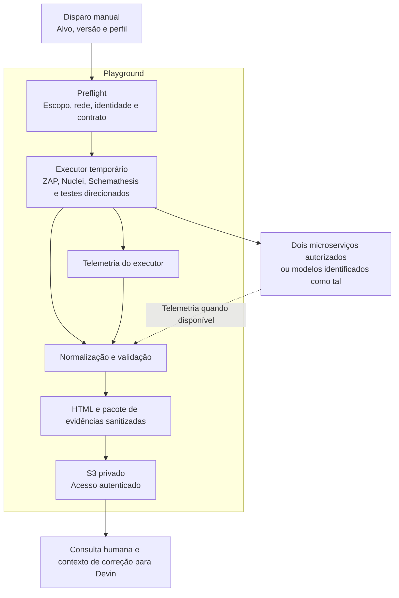
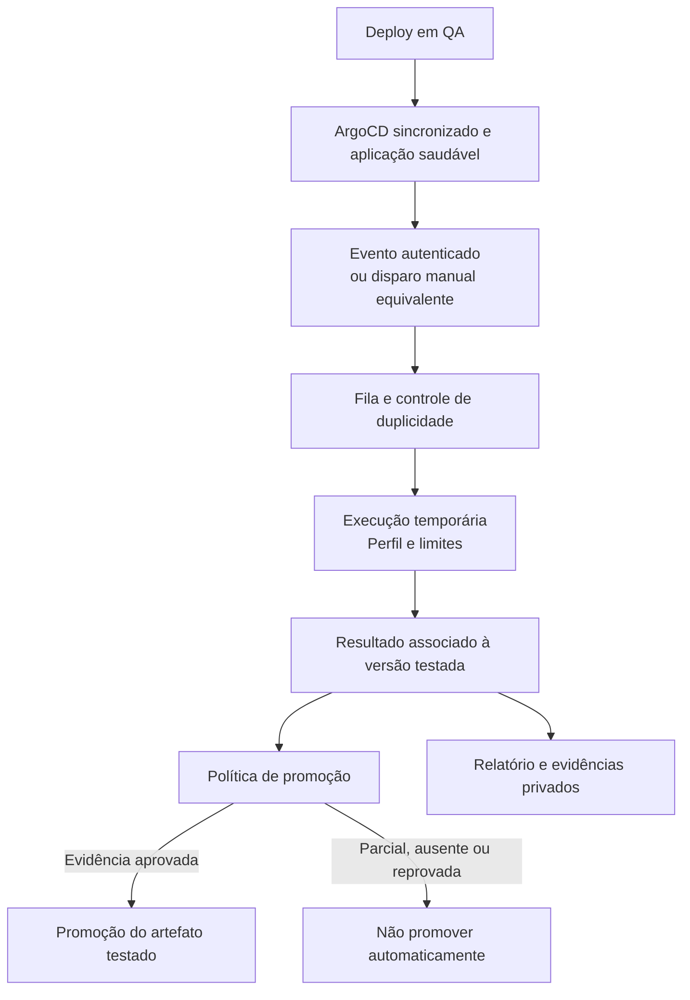

# Arquitetura da PoC DAST

**Proposta para validação — 07/10/2026.** Objetivo imediato: dois microserviços de teste no playground; destino posterior: testes de releases em QA. Nenhuma nova infraestrutura foi implantada por este pacote. Os ambientes abaixo são papéis genéricos, não a topologia de uma organização.

## Ambientes e fronteiras

| Ambiente | Papel |
|---|---|
| Local | Laboratório anterior e origem dos componentes reutilizáveis. |
| Playground AWS | Execução e medição da primeira entrega. |
| Plataforma DevOps compartilhada | Possível hospedagem de runners e ArgoCD; capacidade e acesso a confirmar. |
| QA | Aplicações candidatas e destino operacional pretendido para DAST. |

A localização do ArgoCD não comprova onde o workload roda. Confirmar cluster/namespace de destino de cada Application. Região, contas, redes e nomes reais serão mantidos em configuração corporativa autorizada, não neste Git pessoal.

## Desenho do playground

Trace significa eventos correlacionados das etapas; tracing distribuído dentro da aplicação não é presumido. DefectDojo não participa deste fluxo.

## Escolha de execução

1. **Reusar cluster existente** se houver acesso imediato, capacidade isolada e conectividade. Jobs temporários, quotas e recursos limitados; não competir sem controle com runners.
2. **EC2 temporária com containers/Compose** como alternativa de menor adaptação ao laboratório, se não houver cluster pronto. Desligar ao encerrar a janela; discos e demais recursos persistentes continuam tendo custo.
3. **ECS/Fargate** como candidato para execução sob demanda futura, após validar compatibilidade do executor e da telemetria.

Não criar EKS dedicado apenas para dois testes sem justificativa. Não há escolha definitiva nem sizing aprovado. Separar recursos de scanners e alvos quando hospedados no playground para evitar métricas contaminadas por contenção.

## Qual endereço testar

- Caminho principal: Gateway/Ingress usado pelo consumidor em QA, com autenticação autorizada.
- Caminho complementar: Service/Ingress privado, quando autorizado, para avaliar controles do microserviço. Não usar IP de Pod como endereço padrão.
- Registrar o caminho em cada execução; não misturar os dois resultados.
- Sem conectividade: diagnosticar DNS, rota, TLS, controles de rede e identidade. Não abrir acesso público ou desativar autenticação para viabilizar a PoC.
- Se a liberação não couber no prazo, usar aplicações-modelo no playground e declarar a limitação. Não chamar isso de validação corporativa.

## Evolução após a medição

O deploy em QA pode concluir antes do scan. A promoção para produção exige evidência válida conforme a política; automação desse controle ainda não existe neste pacote. Preferência: notificação pós-deploy para fila, não scan longo acoplado a PostSync.

O receptor valida origem e autorização do alvo. Deduplicar por aplicação, ambiente, versão/configuração, perfil e regras; permitir reteste explícito. Detectar mudança do alvo durante a execução. Commit Ops, commit de código e digest são identidades distintas. Em ambientes com vários serviços, registrar dependências relevantes.

## Perfis e responsabilidade das ferramentas

| Perfil | Uso | Orçamento experimental |
|---|---|---|
| smoke | Cada deploy em QA | Até 5 min |
| release | Candidata à produção | Até 20 min |
| deep | Agenda ou mudança de risco | Janela inicial de 60 min |
| incident | Campanha autorizada | Definido por campanha |

São hipóteses a medir, não SLAs nem garantia de cobertura completa. Tempo esgotado sem cobertura obrigatória é parcial.

ZAP cobre descoberta e análise passiva/ativa; Nuclei verificações por templates; Schemathesis contrato/propriedades; testes direcionados autorização e negócio. Autenticação nativa primeiro; adapter apenas se houver necessidade comprovada.

Terraform gerencia infraestrutura AWS; ArgoCD pode gerenciar configuração Kubernetes; o orquestrador dispara Jobs/tasks. Imagens, regras e templates fixados e homologados, sem atualização automática indiscriminada.

## Decisões que faltam

| Decisão | Efeito |
|---|---|
| Executor disponível e região | Implantação e preços aplicáveis |
| Alvos, rota de acesso e identidades | Escopo executável e conectividade |
| Recursos, concorrência e critérios de interrupção | Impacto e custo |
| S3, mecanismo autenticado de leitura e retenção | Publicação e ciclo de vida |
| Disparo e integração com promoção | Evolução para QA |

Escala depende de deploys por hora, duração e concorrência permitida, não do número de repositórios. O inventário de serviços, tecnologias e frequência deve ser medido em cada adoção, sem presumir proporções.

Referências: [ArgoCD triggers](https://argo-cd.readthedocs.io/en/stable/operator-manual/notifications/triggers/), [hooks](https://argo-cd.readthedocs.io/en/stable/user-guide/sync-waves/), [EKS pricing](https://aws.amazon.com/eks/pricing/), [Fargate pricing](https://aws.amazon.com/fargate/pricing/). Conferidas na discussão em 07/10/2026; verificar versão instalada e preço/região antes de implementar.
